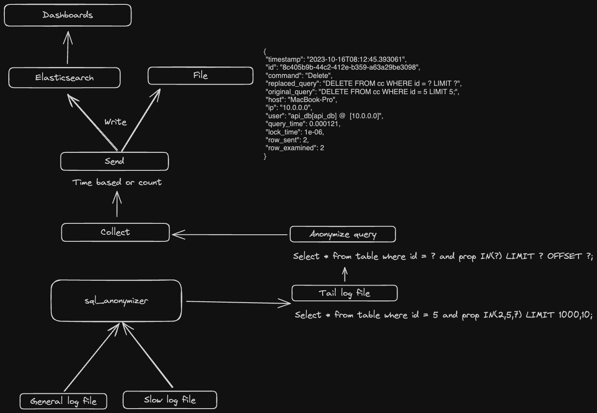
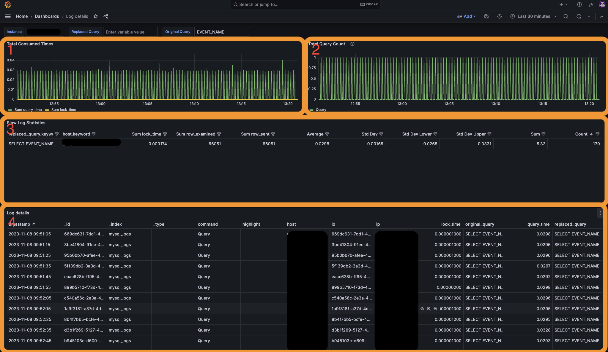
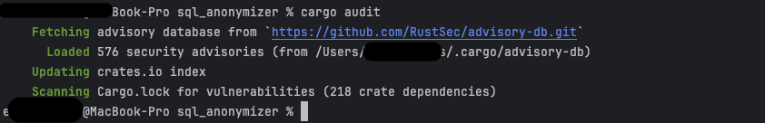

## SQL Anonymizer

Source Repo:
[<u>https://github.com/emin100/sql_anonymizer</u>](https://github.com/emin100/sql_anonymizer)

Releases(For Compiled Binaries):
[<u>https://github.com/emin100/sql_anonymizer/releases</u>](https://github.com/emin100/sql_anonymizer/releases)


## Process:

1.  Listen to log files. (Please check log lines in format section)
2.  Create SQL Abstract Syntax Tree. For example:
```rust
AST: [Query(Query { ctes: [], body: Select(Select { distinct: false, projection: [UnnamedExpr(Identifier("a")), UnnamedExpr(Identifier("b")), UnnamedExpr(Value(Long(123))), UnnamedExpr(Function(Function { name: ObjectName(["myfunc"]), args: [Identifier("b")], filter: None, over: None, distinct: false }))], from: [TableWithJoins { relation: Table { name: ObjectName(["table_1"]), alias: None, args: [], with_hints: [] }, joins: [] }], selection: Some(BinaryOp { left: BinaryOp { left: Identifier("a"), op: Gt, right: Identifier("b") }, op: And, right: BinaryOp { left: Identifier("b"), op: Lt, right: Value(Long(100)) } }), group_by: [], having: None }), order_by: [OrderByExpr { expr: Identifier("a"), asc: Some(false) }, OrderByExpr { expr: Identifier("b"), asc: None }], limit: None, offset: None, fetch: None })]
```
3.  Change `Value` type to `Value::Placeholder` in AST
4.  Rewrite sql from AST.(Please check outputs in format section)
5.  Send log to elasticsearch or file

## Design




## Installation

Download compiled binary in the release page or build with cargo build
command.


##  Usage

```
Usage: sql_normalizer-arm-macos send [OPTIONS] --input <INPUT>

Options:
  -e, --elastic-host <ELASTIC_HOST>
          Elastic host. Env: ELASTIC_HOST [env: ELASTIC_HOST=]
  -l, --log-level <LOG_LEVEL>
          Turn debugging information on [default: error]
  -u, --elastic-user <ELASTIC_USER>
          Sets Elastic username [env: ELASTIC_USER=]
  -p, --elastic-password <ELASTIC_PASSWORD>
          Sets Elastic password [env: ELASTIC_PASSWORD=]
  -t, --output <OUTPUT>
          Sets an output type [default: file] [possible values: file, elastic]
  -i, --input <INPUT>
          Sets an input type [default: general] [possible values: slow, general]
  -f, --input-file <FILE>
          Sets a input file path
  -o, --output-file <FILE>
          Sets a output file path [default: output.txt]
  -s, --elastic-push-size <ELASTIC_PUSH_SIZE>
          Sets a push size [default: 1000]
  -c, --elastic-push-seconds <ELASTIC_PUSH_SECONDS>
          Sets a push seconds [default: 15]
  -n, --elastic-index-name <ELASTIC_INDEX_NAME>
          Sets Elastic password [env: ELASTIC_INDEX=] [default: mysql_logs]
  -q, --query
          Log original query
  -h, --help
          Print help
```

#### Example for send output to elasticsearch:

1.  Export the elasticsearch information or add the command
    ```bash
    export ELASTIC_PASSWORD=password
    export ELASTIC_USER=username
    export ELASTIC_HOST=https://hosts.com:9200
    ```
2. Execute the binary
   * For listen general log
       ```bash
       sql_normalizer send -t elastic -i general -f ./instance1.log -c 600 -q
       ```
   * For listen slow log
      ```bash
      sql_normalizer send -t elastic -i slow -f ./instance1-slow.log -c 600 -q
      ```

#### Example for send output to file:

1. Execute the binary
   - For listen to general log
      ```bash
      sql_normalizer send -t file -o output.txt -i general -f ./instance1.log -c 600 -q
      ```
   - For listen to slow log
      ```bash
       sql_normalizer send -t file -o output.txt -i slow -f ./instance1-slow.log -c 600 -q
      ```
## Metrics:

### Collected Metrics:

- timestamp: Original log time.
- id: Log record identifier.
- command: The type of the queries.(Query,Insert,Update,Other,Explain,Delete)
- replaced_query: Changed query from the parser.
- original_query: Original query.
- host: The hostname of the instances.
- ip: The ip address of the client.
- user: The username of the user.
- query_time: The statement execution time in seconds.
- lock_time: The time to acquire locks in seconds.
- row_sent: The number of rows sent to the client.
- row_examined: The number of rows examined by the server layer (not counting any processing internal to storage engines).

### Other Metrics in slow log file:

These metrics are available and collectable by the parser.

- Thread_id: The statement thread identifier.
- Errno: The statement error number, or 0 if no error occurred.
- Killed: If the statement was terminated, the error number indicating why, or 0 if the statement terminated normally.
- Bytes_received: The
  [<u>Bytes_received</u>](https://dev.mysql.com/doc/refman/8.0/en/server-status-variables.html#statvar_Bytes_received)
  value for the statement.

- Bytes_sent: The
  [<u>Bytes_sent</u>](https://dev.mysql.com/doc/refman/8.0/en/server-status-variables.html#statvar_Bytes_sent)
  value for the statement.
- Read_first: The
  [<u>Handler_read_first</u>](https://dev.mysql.com/doc/refman/8.0/en/server-status-variables.html#statvar_Handler_read_first)
  value for the statement.
- Read_last: The
  [<u>Handler_read_last</u>](https://dev.mysql.com/doc/refman/8.0/en/server-status-variables.html#statvar_Handler_read_last)
  value for the statement.
- Read_key: The
  [<u>Handler_read_key</u>](https://dev.mysql.com/doc/refman/8.0/en/server-status-variables.html#statvar_Handler_read_key)
  value for the statement.
- Read_next: The
  [<u>Handler_read_next</u>](https://dev.mysql.com/doc/refman/8.0/en/server-status-variables.html#statvar_Handler_read_next)
  value for the statement.
- Read_prev: The
  [<u>Handler_read_prev</u>](https://dev.mysql.com/doc/refman/8.0/en/server-status-variables.html#statvar_Handler_read_prev)
  value for the statement.
- Read_rnd: The
  [<u>Handler_read_rnd</u>](https://dev.mysql.com/doc/refman/8.0/en/server-status-variables.html#statvar_Handler_read_rnd)
  value for the statement.
- Read_rnd_next: The
  [<u>Handler_read_rnd_next</u>](https://dev.mysql.com/doc/refman/8.0/en/server-status-variables.html#statvar_Handler_read_rnd_next)
  value for the statement.
- Sort_merge_passes: The
  [<u>Sort_merge_passes</u>](https://dev.mysql.com/doc/refman/8.0/en/server-status-variables.html#statvar_Sort_merge_passes)
  value for the statement.
- Sort_range_count: The
  [<u>Sort_range</u>](https://dev.mysql.com/doc/refman/8.0/en/server-status-variables.html#statvar_Sort_range)
  value for the statement.
- Sort_rows: The
  [<u>Sort_rows</u>](https://dev.mysql.com/doc/refman/8.0/en/server-status-variables.html#statvar_Sort_rows)
  value for the statement.
- Sort_scan_count: The
  [<u>Sort_scan</u>](https://dev.mysql.com/doc/refman/8.0/en/server-status-variables.html#statvar_Sort_scan)
  value for the statement.
- Created_tmp_disk_tables: The
  [<u>Created_tmp_disk_tables</u>](https://dev.mysql.com/doc/refman/8.0/en/server-status-variables.html#statvar_Created_tmp_disk_tables)
  value for the statement.
- Created_tmp_tables: The
  [<u>Created_tmp_tables</u>](https://dev.mysql.com/doc/refman/8.0/en/server-status-variables.html#statvar_Created_tmp_tables)
  value for the statement.
- Start: The statement execution start time.
- End: The statement execution end time.

## Format:

### General Log Line:

```log
2023-09-20T14:14:38.673981Z 3481056 Query SELECT * FROM cc WHERE id = 5 LIMIT 0,10000
```

### Parser Output:

```json
{
    "timestamp": "2023-09-20T14:14:38.673981",
    "id": "a66fde66-ae43-4dcf-8db5-44186c4e5458",
    "command": "Query",
    "replaced_query": "SELECT * FROM cc WHERE id = ? LIMIT ? OFFSET ?",
    "original_query": "SELECT * FROM cc WHERE id = 5 LIMIT 0,10000",
    "host": "MacBook-Pro",
    "ip": "10.0.0.0",
    "user": null,
    "query_time": null,
    "lock_time": null,
    "row_sent": null,
    "row_examined": null
}
```

### Slow Log Lines:

```log
# Time: 2023-10-16T08:12:45.393061Z
# User@Host: api_db[api_db] @ [10.0.0.0] Id: 2182431
# Query_time: 0.000121 Lock_time: 0.000001 Rows_sent: 2 Rows_examined: 2 Thread_id: 2182431 Errno: 0 Killed: 0
Bytes_received: 142 Bytes_sent: 992 Read_first: 0 Read_last: 0 Read_key: 1 Read_next: 2 Read_prev: 0 Read_rnd: 0 
Read_rnd_next: 0 Sort_merge_passes: 0 Sort_range_count: 0 Sort_rows: 0 Sort_scan_count: 0 Created_tmp_disk_tables: 0 
Created_tmp_tables: 0 Start: 2023-10-16T08:12:45.392940Z End: 2023-10-16T08:12:45.393061Z
SET timestamp=1697443965;
DELETE FROM cc WHERE id = 5 LIMIT 5;
```

### Parser Output:

```json
{
    "timestamp": "2023-10-16T08:12:45.393061",
    "id": "8c405b9b-44c2-412e-b359-a63a29be3098",
    "command": "Delete",
    "replaced_query": "DELETE FROM cc WHERE id = ? LIMIT ?",
    "original_query": "DELETE FROM cc WHERE id = 5 LIMIT 5;",
    "host": "MacBook-Pro",
    "ip": "10.0.0.0",
    "user": "api_db[api_db] @ [10.0.0.0]",
    "query_time": 0.000121,
    "lock_time": 1e-0,
    "row_sent": 2,
    "row_examined": 2
}
```

## Virtualization:

### Grafana:

#### Dashboard: [resources/grafana/dashboard.yml](dashboard.yml)



1. That graph shows us total query time and total lock times.
2. That graph shows us total query counts.
3. That table gives us anonymized query statistics.(Sum, average, standard deviation vs)
4. That table gives us detail of the queries.

### Row Data:
View on the kibana dashboard or file

## Vulnerability Check:

Checked with
[<u>cargo-audit</u>](https://github.com/rustsec/rustsec/tree/main/cargo-audit)



Advisory database for rust:
[<u>https://rustsec.org/advisories/</u>](https://rustsec.org/advisories/)
